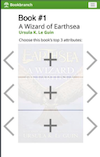
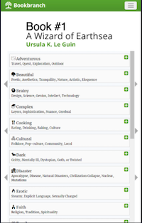
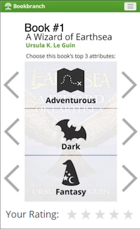

# BookBranch
## Team A Spring / Summer 2019 Capstone
Sponsorered by Dan Hahn

Cross platform mobile app for Easier Book Discovery and Review
Inspired from BookBranch.ch

### Prerequisites

What things you need to install the software and how to install them

### Installing
>npm install -g react-native-cli

#### For IOS
>react-native run-ios
#### For Android
>react-native run-android

#### Documentation 
>https://facebook.github.io/react-native/docs/getting-started

## License

This project is licensed under the MIT License - see the [LICENSE.md](LICENSE.md) file for details

